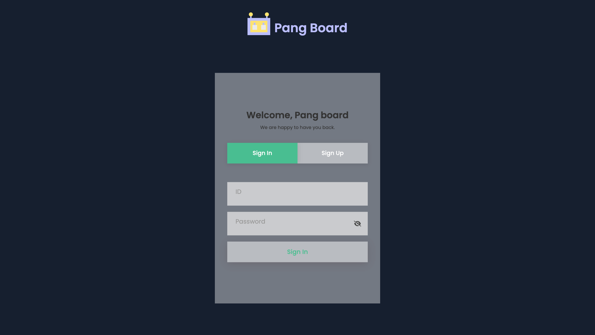

# pang-board

> 게시글을 자유롭게 작성할 수 있는 웹 사이트입니다.

로그인 후 게시글을 작성하고, 목록화 된 게스글을 확인할 수 있으며 본인의 글에 수정/삭제가 가능합니다.

### demo

[http://panggini.site/](http://panggini.site/)



## 설치 방법

아래 단계를 따라 프로젝트를 설치하세요.

1. 프로젝트를 클론합니다.

   ```bash
   git clone https://github.com/sorate7624/pang-board.git
   ```

2. 프로젝트 디렉토리로 이동합니다.

   ```bash
   cd pang-board
   ```

3. 종속성을 설치합니다.

   ```bash
   npm install
   ```

4. 프로젝트를 실행합니다.
   ```bash
   npm run dev
   ```

## 기술 스택

프로젝트의 기술 스택은 다음과 같습니다.

### Development

<div style="display: flex">
  
  
  
  
  
  
  <br/>
</div>

### Environment

<div style="display: flex">
  
  
  
  
  
  
</div>

### Config

<div style="display: flex">
  
  
  
  
</div>

## 폴더 구조

프로젝트의 주요 폴더 구조는 다음과 같습니다.

- `dist/`: 빌드 시 최적화된 정적 파일들이 저장되는 파일들이 여기에 위치합니다.
- `public/`: 정적 파일들을 담고 있는 폴더입니다.
- `src/`: 프로젝트의 소스 코드를 담고 있는 폴더입니다. `App.jsx`, `main.jsx` 파일이 여기에 위치합니다.
  - `actions/`: 상태 변경을 위한 객체, 특정 이벤트 또는 사용자 입력과 같은 상황에서 발생하는 파일을 담고 있는 폴더입니다.
  - `components/`: component 파일들을 담고 있는 폴더입니다.
  - `consts/`: const 파일들을 담고 있는 폴더입니다.
  - `css/`: css 파일들을 담고 있는 폴더입니다.
  - `layout/`: 레이아웃 파일들을 담고 있는 폴더입니다.
  - `reducers/`: 액션에 따라 상태를 변경하는 함수들을 담고 있는 폴더입니다.
  - `routes/`: 라우트 파일들을 담고 있는 폴더입니다.
  - `scss/`: scss 파일들을 담고 있는 폴더입니다.
  - `store/`: 애플리케이션 상태를 저장하고 전체의 상태를 중앙에서 관리하는 폴더입니다.
- `docker-compose.yml`: 여러 개의 도커 컨테이너를 정의하고 관리하는데 사용되는 설정 파일입니다.
- `Dockerfile`: 도커 이미지를 생성하기 위한 명령어와 설정들을 포함한 파일입니다.
- `vite.config.js`: vite 설정 파일입니다.

## 업데이트 내역

- 0.0.30
  - redux로 상태관리 적용
- 0.0.29
  - develop 브랜치 생성
- 0.0.28
  - 목록 No 숫자 역순 처리
- 0.0.27
  - update, delete 요청 데이터 수정
- 0.0.26
  - nohup방식으로 수정
- 0.0.25
  - docker파일 수정
- 0.0.24
  - yml 파일 수정
- 0.0.23
  - 띄어쓰기 추가
- 0.0.22
  - Docker 파일 수정
- 0.0.21
  - http-server로 명령어 수정
- 0.0.20
  - npm run start 추가
- 0.0.19
  - 정적 파일 경로 지정
- 0.0.18
  - base url 수정
- 0.0.17
  - vite 설정 파일 수정
- 0.0.16
  - step2 주석 처리
- 0.0.15
  - http-server로 명령어 수정
- 0.0.14
  - npm run start 명령어 수정
- 0.0.13
  - 컨테이너 복사 경로 수정
- 0.0.12
  - ./dist 내용 추가
- 0.0.11
  - 4173포트 8080으로 수정
- 0.0.10
  - ui 수정 및 sweetalert2 기능 추가
- 0.0.9
  - npm run start 포트 8080으로 수정
- 0.0.8
  - 도커 파일 cors 추가
- 0.0.7
  - node-sass패키지 삭제
- 0.0.6
  - 도커 파일 copy 부분 수정
- 0.0.5
  - 도커 파일 수정
- 0.0.4
  - 배포 설정 파일 preview 부분 수정
- 0.0.3
  - 리액트 쿼리로 에러 처리
- 0.0.2
  - 배포를 위한 설정파일 추가 및 수정
- 0.0.1
  - 팡보드 프로젝트 생성

## 정보

최혜진 – sorate_@naver.com

[https://github.com/sorate7624/](https://github.com/sorate7624/)

## 기여 방법

1. (<https://github.com/sorate7624/pang-board/fork>)을 포크합니다.
2. (`git checkout -b feature/fooBar`) 명령어로 새 브랜치를 만드세요.
3. (`git commit -am 'Add some fooBar'`) 명령어로 커밋하세요.
4. (`git push origin feature/fooBar`) 명령어로 브랜치에 푸시하세요.
5. 풀리퀘스트를 보내주세요.
